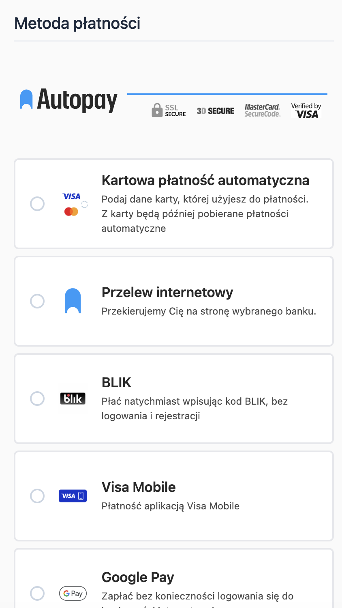
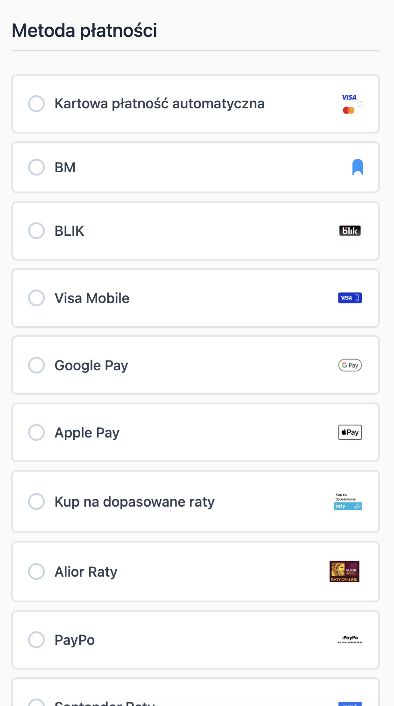

# Instrukcja dla modułu Magento 2: Autopay dla Hyvä Checkout

## Podstawowe informacje
`BlueMedia_HyvaPayment` jest modułem kompatybilności dla sklepów Magento 2 korzystających z Hyvä Checkout. Rozszerza podstawowy moduł płatności `BlueMedia_BluePayment` o widoki, style i komponenty Magewire wymagane do obsługi płatności Autopay w checkout Hyvä.

Moduł nie zastępuje `BlueMedia_BluePayment`. Moduł bazowy nadal odpowiada za konfigurację płatności, komunikację z Autopay, synchronizację kanałów płatności, obsługę ITN, zwroty i dane transakcyjne.

### Wymagania
- Magento 2 z działającym Hyvä Checkout.
- Aktywny moduł `BlueMedia_BluePayment`.
- Aktywne moduły Hyvä wymagane przez `BlueMedia_HyvaPayment`:
  - `Hyva_Checkout`,
  - `Hyva_CompatModuleFallback`.
- Zgodna wersja PHP i Magento taka sama jak dla modułu bazowego.

### Tabela kompatybilności

| Pakiet Composer | Moduł Magento | Wymagany moduł bazowy BlueMedia_BluePayment | Magento | PHP | Uwagi |
|-----------------|----------------|---------------------------------------------|---------|-----|-------|
| `bluepayment-plugin/magento-hyva-autopay` 1.0.0 | `BlueMedia_HyvaPayment` | 2.33.0 lub nowszy | Jak dla modułu bazowego | Jak dla modułu bazowego | Pierwsza wersja modułu Hyvä Checkout. |

Moduł Hyvä powinien być aktualizowany razem z modułem bazowym. Jeżeli instalujesz nowszą wersję `BlueMedia_BluePayment`, użyj najnowszej dostępnej wersji `BlueMedia_HyvaPayment`.

### Co nowego
Lista zmian znajduje się w [CHANGELOG.md](CHANGELOG.md).

## Instalacja

### Przez Composer
Zainstaluj moduł poleceniem:

```bash
composer require bluepayment-plugin/magento-hyva-autopay
```

Następnie przejdź do [aktywacji modułu](#aktywacja-modułu).

### Przez paczkę ZIP
1. Pobierz paczkę modułu Hyvä.
2. Wgraj plik ZIP do katalogu głównego Magento.
3. Będąc w katalogu głównym Magento, wykonaj:

```bash
unzip -o -d app/code/BlueMedia/HyvaPayment bluepayment-hyva-payment-*.zip
rm bluepayment-hyva-payment-*.zip
```

4. Przejdź do [aktywacji modułu](#aktywacja-modułu).

## Aktywacja modułu
Wykonaj polecenia w katalogu głównym Magento:

```bash
bin/magento module:enable BlueMedia_BluePayment BlueMedia_HyvaPayment --clear-static-content
bin/magento setup:upgrade
bin/magento setup:di:compile
bin/magento setup:static-content:deploy
bin/magento cache:flush
```

Jeżeli `BlueMedia_BluePayment` jest już aktywny, możesz włączyć sam moduł Hyvä:

```bash
bin/magento module:enable BlueMedia_HyvaPayment --clear-static-content
bin/magento setup:upgrade
bin/magento setup:di:compile
bin/magento setup:static-content:deploy
bin/magento cache:flush
```

Po aktywacji sprawdź status modułów:

```bash
bin/magento module:status BlueMedia_BluePayment BlueMedia_HyvaPayment Hyva_Checkout Hyva_CompatModuleFallback
```

## Konfiguracja

### Konfiguracja płatności Autopay
Konfigurację danych serwisu, trybu testowego, kanałów płatności, BLIK 0, Google Pay, kart, płatności one click i zwrotów wykonuje się w module bazowym:

**Stores** -> **Configuration** -> **Sales** -> **Payment Methods** -> **Autopay Online Payment**

Szczegółowy opis znajduje się w README modułu bazowego.

### Konfiguracja Hyvä Checkout
Moduł Hyvä dodaje osobną sekcję konfiguracji w ustawieniach metody Autopay:

**Stores** -> **Configuration** -> **Sales** -> **Payment Methods** -> **Autopay Online Payment** -> **Hyvä Checkout**

Dostępna opcja:

| Pole | Domyślnie | Opis |
| --- | --- | --- |
| **Override Hyvä payment list template** | **No** | Po włączeniu moduł zastępuje domyślny szablon listy metod płatności Hyvä własnym szablonem Autopay. |

## Widok listy metod płatności
Domyślnie moduł korzysta ze standardowej listy metod płatności Hyvä Checkout.

Po włączeniu opcji **Override Hyvä payment list template** moduł używa szablonu Autopay, który:
- pokazuje ikonę kanału płatności po lewej stronie,
- dodaje krótki opis kanału płatności pod nazwą,
- dodaje grupowanie wszystkich kanałów płatności Autopay nagłówkiem.

**Szablon Autopay:**



**Domyślny szablon Hyvä:**



## Kanały i oddzielne metody płatności
Lista kanałów płatności pochodzi z modułu `BlueMedia_BluePayment`. Aby kanały były widoczne w Hyvä Checkout:

1. Skonfiguruj dane serwisu Autopay w module bazowym.
2. Zsynchronizuj kanały płatności w panelu administracyjnym Magento.
3. W module bazowym ustaw, czy kanały mają być prezentowane jako lista w metodzie Autopay, czy jako oddzielne metody płatności.
4. Wyczyść cache Magento.

Oddzielne metody płatności korzystają z tej samej konfiguracji kanałów, kolejności sortowania, opisów i ikon co standardowy checkout Magento.
