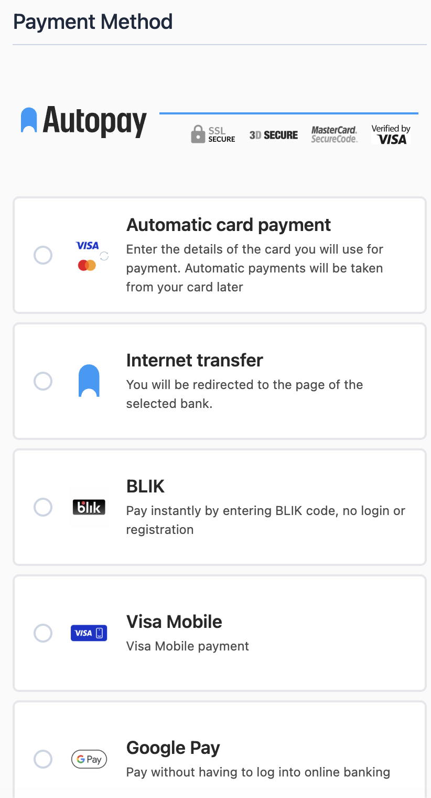
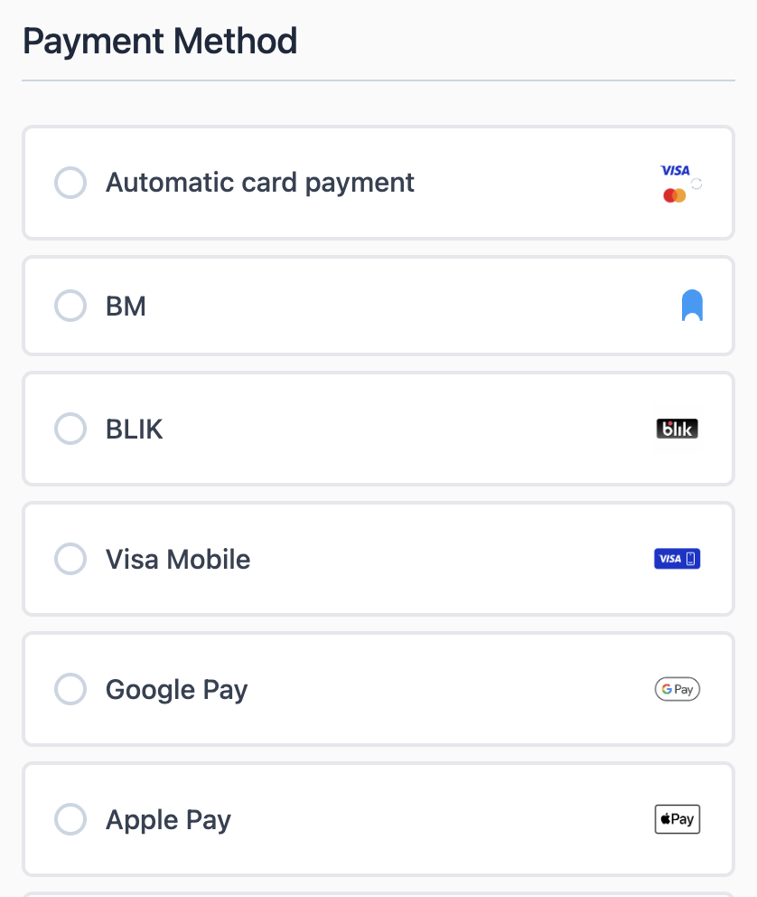

# Instructions for the Magento 2 module: Autopay for Hyvä Checkout

## Basic information
`BlueMedia_HyvaPayment` is a compatibility module for Magento 2 stores using Hyvä Checkout. It extends the base payment module `BlueMedia_BluePayment` with views, styles, and Magewire components required to support Autopay payments in Hyvä Checkout.

This module does not replace `BlueMedia_BluePayment`. The base module remains responsible for payment configuration, communication with Autopay, payment channel synchronization, ITN handling, refunds, and transaction data.

### Requirements
- Magento 2 with a working Hyvä Checkout installation.
- Active `BlueMedia_BluePayment` module.
- Active Hyvä modules required by `BlueMedia_HyvaPayment`:
    - `Hyva_Checkout`,
    - `Hyva_CompatModuleFallback`.
- Compatible PHP and Magento versions, the same as required by the base module.

### Compatibility table

| Composer package                                | Magento module          | Required base module BlueMedia_BluePayment | Magento                     | PHP                         | Notes                                      |
|-------------------------------------------------|-------------------------|--------------------------------------------|-----------------------------|-----------------------------|--------------------------------------------|
| `bluepayment-plugin/magento-hyva-autopay` 1.0.0 | `BlueMedia_HyvaPayment` | 2.33.0 or newer                            | Same as for the base module | Same as for the base module | First release of the Hyvä Checkout module. |

The Hyvä module should be updated together with the base module. If you install a newer version of `BlueMedia_BluePayment`, use the latest available version of `BlueMedia_HyvaPayment`.

### What’s new

The list of changes is available in [CHANGELOG.md](CHANGELOG.md).

## Installation

### Via Composer
Install the module with the following command:

```bash
composer require bluepayment-plugin/magento-hyva-autopay
```
Then go to [module activation](#module-activation).

### Via ZIP package
1. Download the Hyvä module package.
2. Upload the ZIP file to the Magento root directory.
3. From the Magento root directory, run:

```bash
unzip -o -d app/code/BlueMedia/HyvaPayment bluepayment-hyva-payment-*.zip
rm bluepayment-hyva-payment-*.zip
```

4. Go to [module activation](#module-activation).

## Module activation
Run the following commands from the Magento root directory:

```bash
bin/magento module:enable BlueMedia_BluePayment BlueMedia_HyvaPayment --clear-static-content
bin/magento setup:upgrade
bin/magento setup:di:compile
bin/magento setup:static-content:deploy
bin/magento cache:flush
```

If `BlueMedia_BluePayment` is already active, you can enable only the Hyvä module:

```bash
bin/magento module:enable BlueMedia_HyvaPayment --clear-static-content
bin/magento setup:upgrade
bin/magento setup:di:compile
bin/magento setup:static-content:deploy
bin/magento cache:flush
```

After activation, check the module status:

```bash
bin/magento module:status BlueMedia_BluePayment BlueMedia_HyvaPayment Hyva_Checkout Hyva_CompatModuleFallback
```

## Configuration

### Autopay payment configuration

Configuration of service credentials, test mode, payment channels, BLIK 0, Google Pay, cards, one-click payments, and refunds is handled in the base module:

**Stores** -> **Configuration** -> **Sales** -> **Payment Methods** -> **Autopay Online Payment**

A detailed description is available in the README of the base module.

### Hyvä Checkout configuration

The Hyvä module adds a separate configuration section in the Autopay payment method settings:

**Stores** -> **Configuration** -> **Sales** -> **Payment Methods** -> **Autopay Online Payment** -> **Hyvä Checkout**

Available option:

| Field                                   | Default | Description                                                                                                     |
|-----------------------------------------|---------|-----------------------------------------------------------------------------------------------------------------|
| **Override Hyvä payment list template** | **No**  | When enabled, the module replaces the default Hyvä payment method list template with a custom Autopay template. |

## Payment method list view

By default, the module uses the standard Hyvä Checkout payment method list.

After enabling **Override Hyvä payment list template**, the module uses the Autopay template, which:

- displays the payment channel icon on the left,
- adds a short payment channel description below the name,
- groups all Autopay payment channels under a heading.

**Autopay template:**



**Default Hyvä template:**



## Channels and separate payment methods

The payment channel list comes from the `BlueMedia_BluePayment` module. To make channels visible in Hyvä Checkout:

1. Configure the Autopay service credentials in the base module.
2. Synchronize payment channels in the Magento admin panel.
3. In the base module, set whether channels should be displayed as a list inside the Autopay method or as separate payment methods.
4. Clear the Magento cache.

Separate payment methods use the same channel configuration, sort order, descriptions, and icons as the standard Magento checkout.
